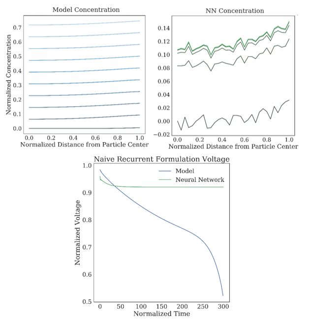
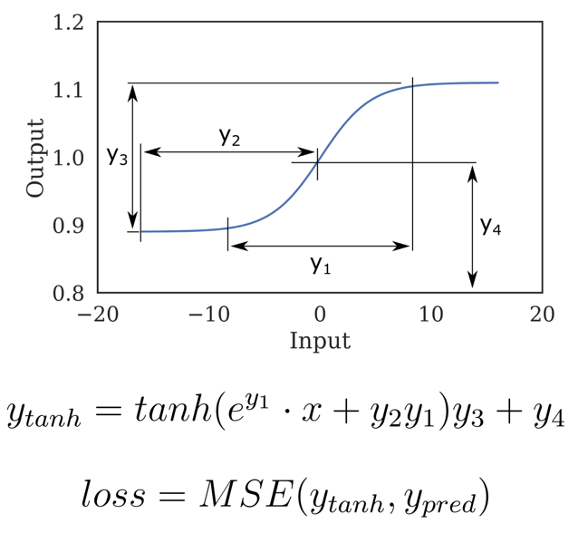
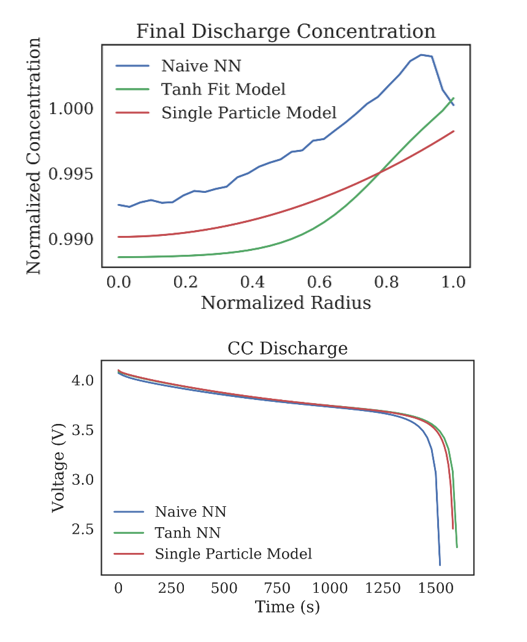

# Physics-Guided Neural Networks

Detailing my unpublished preliminary work on state forecasting with physics-guided neural networks

This repository is in its introductory stages, and code will be uploaded soon. However, here's a sneak peek of the results:

### Original Attempt

Originally, I started by attempting to directly forecast a future state, then recurrently calling the neural network.
However, this resulted in very poor stability and no physical consistency - barring
any AC load, the internal battery Li concentration should be monotonically increasing or decreasing.

### Problem Reformulation

By instead trying to predict the difference between timesteps, it was possible
to significantly increase the stability and forecast-ability of the models.
However, one issue still remained - the physical inconsistency inside the
battery particles.

By looking closer at the shape of what I was trying to predict, I realized
there was a way to enforce a shape on the output of the neural networks.

Instead of having the neural network predict a series of concentrations across
an electrode, I had the neural network fit a hyperbolic tangent to the shape
of the training data. This resulted in a neural network which output
the parameters as listed above which would describe the desired shape.

### The Result

Through these two changes, it was possible to significantly increase the
stability and accuracy of the forecasted states, which can be rebuilt to model
the behavior of the battery.

